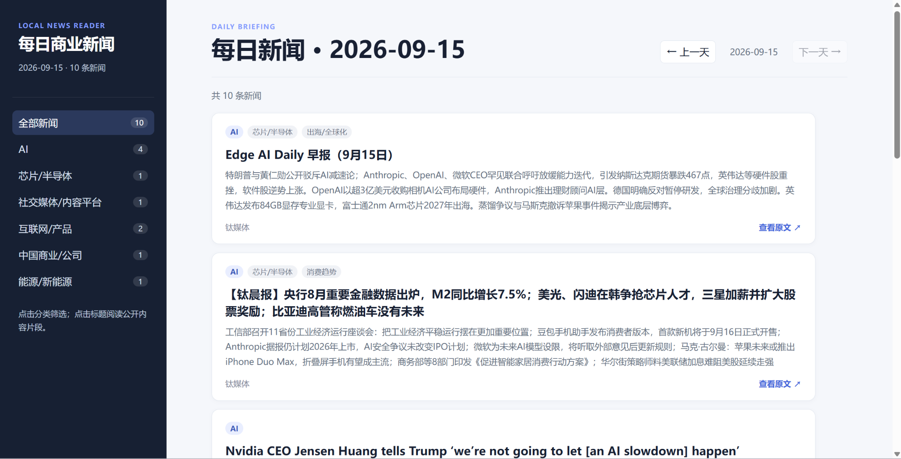
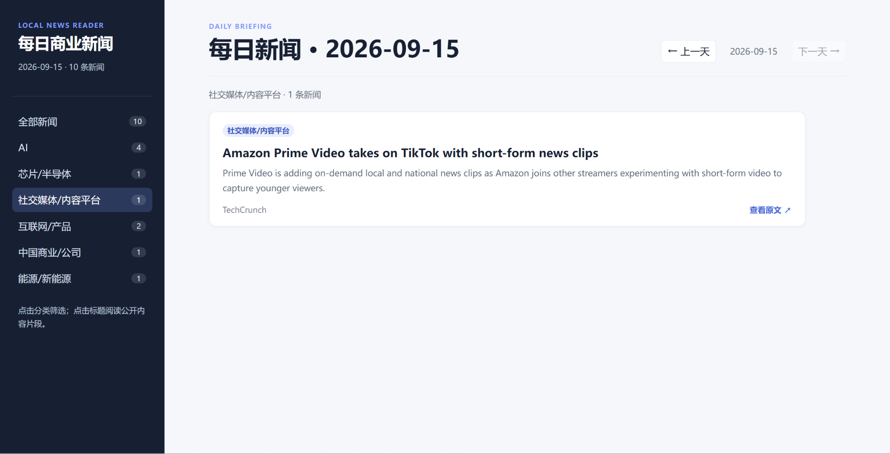
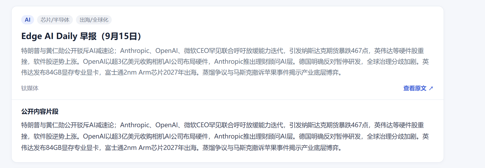
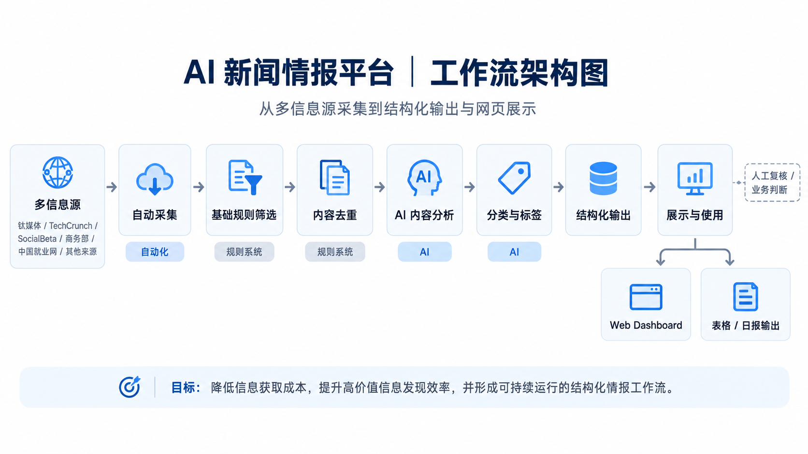

# AI 新闻情报平台

一个面向信息获取与业务研究场景的 AI 新闻情报平台，实现多信息源采集、筛选、去重、AI 分析与结构化输出。

---

## 项目背景

在日常业务研究、行业信息跟踪和内容运营中，信息往往分散在多个来源中。

传统人工处理方式存在几个明显问题：

- 信息源分散，需要反复切换平台
- 每天需要阅读大量低价值内容
- 重复信息较多，筛选成本高
- 人工整理效率低
- 很难形成稳定、结构化的信息输入

因此，我尝试搭建一套自动化新闻情报工作流，将：

**信息采集 → 初步筛选 → 去重 → AI 分析 → 分类 → 结构化输出**

整合成一套可持续运行的流程。

---

## 项目目标

这个项目希望解决一个更完整的业务问题：

> 如何用 AI 和自动化降低信息获取成本，同时提高高价值信息的发现效率。

具体目标包括：

1. 自动完成多信息源采集
2. 尽可能减少重复和低价值内容
3. 利用 AI 辅助理解和分析信息
4. 将最终内容整理成稳定的结构化输出
5. 建立可评估、可持续优化的工作流

---

## 产品展示

### 主界面



平台将每日新闻以 Web Dashboard 的形式进行展示，并按照不同主题进行分类。

每条信息包含：

- 标题
- 摘要
- 分类标签
- 来源
- 原文链接

用户可以直接在网页端完成信息浏览，而不需要查看原始脚本或文件。

---

### 分类筛选



平台支持按照不同主题快速筛选内容，例如：

- AI
- 芯片 / 半导体
- 社交媒体 / 内容平台
- 互联网 / 产品
- 中国商业 / 公司
- 能源 / 新能源

相比传统新闻列表，分类筛选能够帮助用户更快定位自己真正关注的信息。

---

### 单条内容详情



单条内容包含：

- 主分类
- 副标签
- 标题
- 摘要
- 来源
- 原文跳转
- 公开内容片段

通过这种结构，原始新闻被进一步加工成更适合快速阅读和判断的情报卡片。

---

## 工作流架构



整个系统并不是把所有任务全部交给 AI，而是根据不同任务的特点进行分工。

整体流程为：

**多信息源 → 自动采集 → 规则筛选 → 内容去重 → AI 内容分析 → 分类与标签 → 结构化输出 → Web Dashboard / 表格输出**

其中：

- **自动化**：负责信息采集与流程执行
- **规则系统**：负责基础筛选与部分去重
- **AI**：负责内容理解、摘要、分类和价值判断辅助
- **人工判断**：负责最终复核和业务价值判断

我的核心原则是：

> AI应该被放在最适合它的位置。

---

## 核心功能

### 1. 多信息源自动采集

平台当前配置多个不同类型的信息源，通过自动化流程统一获取信息。

目前配置：

**10 个信息源**

信息来源覆盖科技、商业、营销、就业等不同方向。

目标是减少人工逐个平台浏览的时间成本。

---

### 2. 信息筛选

原始信息进入系统后，会先经过基础筛选流程。

主要用于过滤：

- 明显无关内容
- 信息价值较低的内容
- 不符合时间要求的内容
- 不符合业务关注方向的内容

对于规则明确的任务，优先使用规则系统，而不是直接调用 AI。

---

### 3. 内容去重

新闻与行业信息中经常存在：

- 同一事件被多个媒体重复报道
- 标题不同但内容高度相似
- 同一信息被多次转载

因此系统加入去重环节，减少重复阅读和重复输出。

---

### 4. AI 辅助内容分析

经过基础过滤的信息会进入 AI 分析环节。

AI 主要负责：

- 理解文章核心内容
- 提取关键信息
- 生成结构化摘要
- 辅助判断信息价值
- 进行分类与标签生成

AI 在这个项目中的定位不是替代整个流程，而是负责更适合语言理解的环节。

---

### 5. 结构化日报输出

最终保留的信息会形成结构化日报。

相比只保留新闻链接，系统更关注：

- 今天发生了什么
- 信息属于什么主题
- 为什么值得关注
- 信息来自哪里
- 是否需要继续跟踪

---

### 6. Web Dashboard

最终结果被进一步网页化。

用户可以：

- 查看当天全部新闻
- 按主题筛选
- 查看摘要
- 阅读公开内容片段
- 跳转原文
- 浏览不同日期结果

这使项目从一个自动化脚本进一步变成了可直接使用的信息产品。

---

## 当前真实运行数据

项目已经完成连续真实运行测试。

### 信息源规模

- 配置信息源：**10 个**

### 5 天真实运行

- 正式运行：**5 天**
- 累计输出有效内容：**49 条**
- 平均每天约：**9.8 条**

### 单次漏斗审计

一次实际运行中：

```text
54 条原始信息
      ↓
12 条最终保留内容
